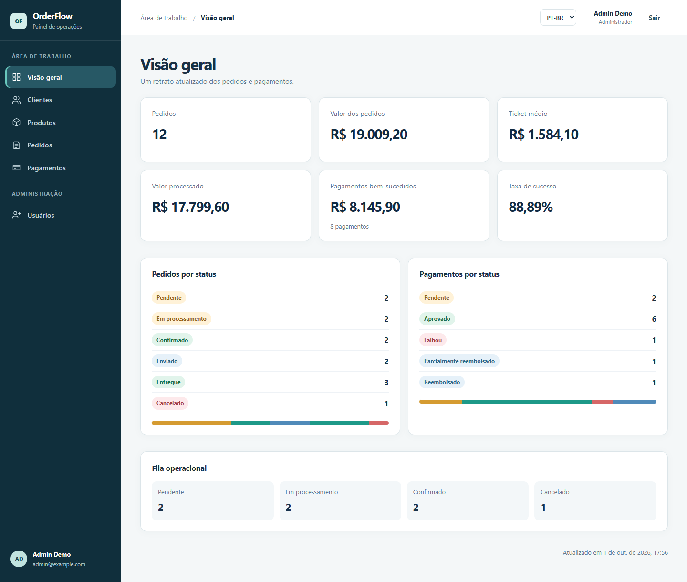
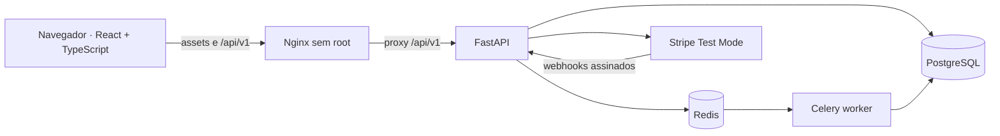
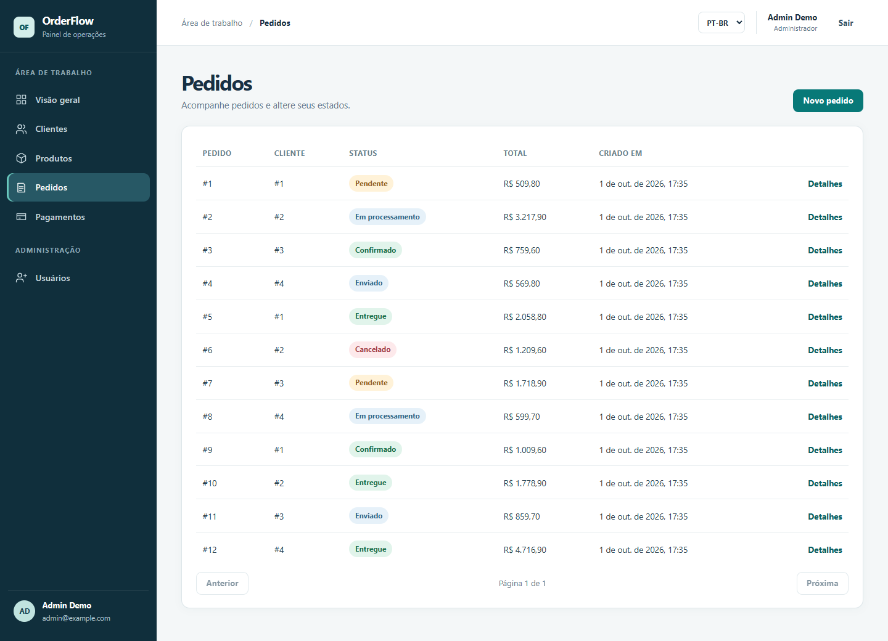
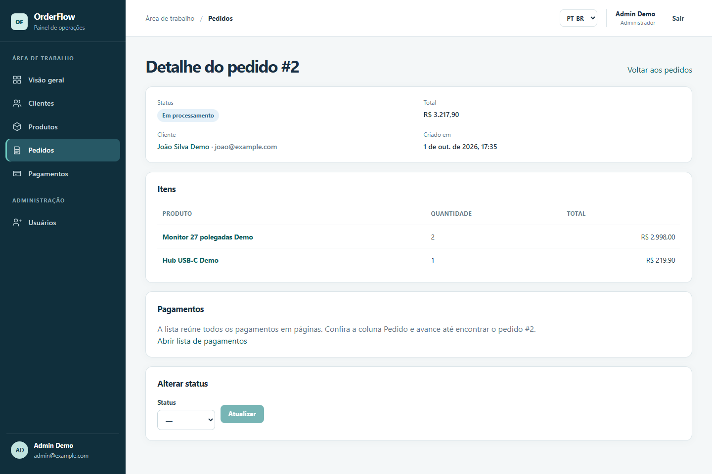
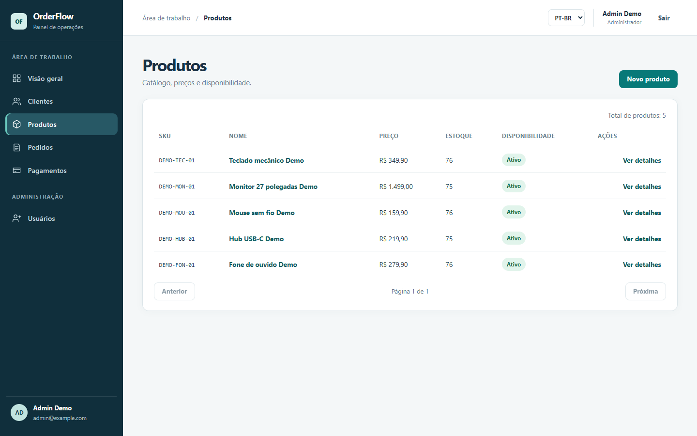
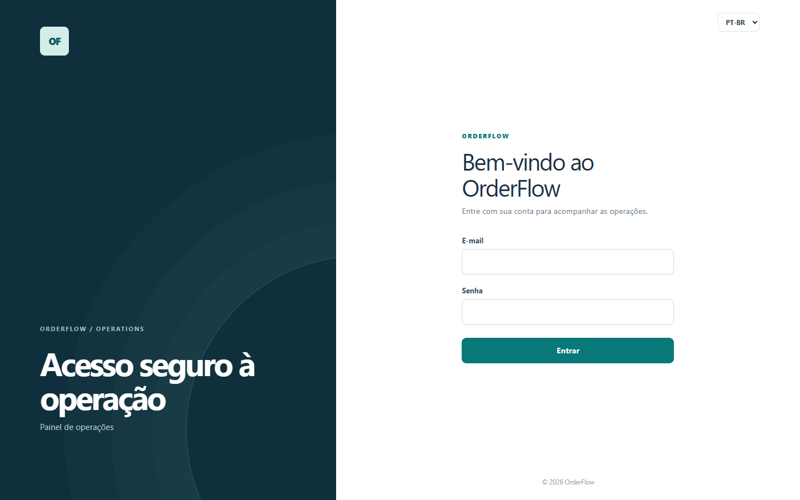

# OrderFlow

Aplicação full stack para gerenciar clientes, produtos, pedidos, pagamentos e
reembolsos. Une um painel React + TypeScript a uma API FastAPI, com PostgreSQL,
Redis, Celery e Stripe Test Mode.

[](https://github.com/Jos3Vitor34/orderflow/actions/workflows/quality.yml)
[](https://github.com/Jos3Vitor34/orderflow/actions/workflows/security.yml)
[](https://github.com/Jos3Vitor34/orderflow/releases/tag/v1.1.0)
[](frontend/README.md)
[](docs/DEVELOPMENT.md)
[](docs/DEPLOYMENT.md)
[](LICENSE)



[Executar localmente](#executando-localmente) · [Screenshots](#screenshots) ·
[Arquitetura](#arquitetura) · [Documentação](#documentação) ·
[Release v1.1.0](https://github.com/Jos3Vitor34/orderflow/releases/tag/v1.1.0)

## Visão geral

O OrderFlow acompanha o fluxo operacional de uma venda: cadastro de clientes e
produtos, composição do pedido, confirmação com débito de estoque e acompanhamento
de pagamentos e reembolsos. O dashboard reúne indicadores desse histórico.

As regras ficam no backend: permissões por papel, transações, locks de estoque e
idempotência protegem as operações. A interface apresenta os dados em português
do Brasil ou inglês e adapta a navegação às permissões do usuário.

## Principais funcionalidades

- **Dashboard:** totais, estados de pedidos e indicadores de pagamentos.
- **Clientes e produtos:** cadastro, edição, consulta paginada, preços e estoque.
- **Pedidos:** itens com snapshot de preço e ciclo `pending → processing →
  confirmed → shipped → delivered`; cancelamento permitido em `pending`.
- **Estoque transacional:** confirmação com locks no PostgreSQL e rollback
  integral quando a operação não pode ser concluída.
- **Pagamentos e refunds:** registros financeiros, Stripe Payment Intents em
  Test Mode, reembolsos totais/parciais, idempotência e webhooks assinados.
- **Autenticação e RBAC:** JWT, papéis `viewer`, `operator` e `admin`, gestão de
  usuários, ativação e proteção do último administrador ativo.
- **Processamento assíncrono:** Celery e Redis para notificações simuladas e
  relatórios, com retries limitados e correlation ID.
- **Interface responsiva:** navegação, formulários, estados de carregamento e
  mensagens em pt-BR e inglês.

## Arquitetura



O React executa no navegador; o Nginx serve seus arquivos estáticos e encaminha
as chamadas da mesma origem à API. Na stack de produção local, apenas o frontend
publica porta em loopback. Alembic aplica as migrations antes da API e os health
checks controlam a inicialização dos serviços.

Pagamentos e reembolsos têm estados próprios e não alteram o ciclo do pedido ou
o estoque. Os detalhes de transações, concorrência e contratos estão no
[guia técnico](docs/DEVELOPMENT.md).

## Stack

| Área | Tecnologias |
| --- | --- |
| Frontend | React, TypeScript, Vite, Tailwind CSS, React Router, TanStack Query, Axios, React Hook Form e Zod |
| Backend | Python 3.12+, FastAPI, SQLAlchemy 2, Pydantic e Alembic |
| Dados e tarefas | PostgreSQL, Redis e Celery |
| Integração financeira | Stripe Test Mode, Payment Intents, refunds e webhooks |
| Infraestrutura local | Docker, Docker Compose, Nginx, secrets montados, volumes e HTTPS opcional |
| Qualidade e segurança | GitHub Actions, Pytest, Vitest, Testing Library, Ruff, mypy, ESLint, Gitleaks, Trivy, pip-audit e npm audit |

## Demo

O projeto não possui ambiente público permanente para evitar custos recorrentes
de infraestrutura. O GitHub é a vitrine pública; a stack completa pode ser
executada localmente com Docker Compose, incluindo frontend em container,
FastAPI, PostgreSQL, Redis e Celery.

Essa é uma decisão de escopo: deploy remoto não é uma pendência do projeto.
A stack de produção local inclui Nginx, reverse proxy, secrets, health/readiness,
migrations, persistência e configuração opcional de TLS. O
[runbook](docs/DEPLOYMENT.md) documenta operação, backup/restore e rollback.

## Screenshots

Capturas da aplicação real executada localmente com Docker Compose, em pt-BR
e com dados fictícios. O dashboard aparece no início deste README. As imagens
registram o estado da `main` posterior à `v1.1.0`; não são mockups.

### Pedidos

Lista com estados, valores e paginação dos pedidos de demonstração.



### Detalhes do pedido

Cliente, itens, total e controles de transição de um pedido em processamento.



<details>
<summary>Ver produtos e login</summary>

### Produtos

Catálogo com SKU, preço, estoque e disponibilidade.



### Login

Formulário de acesso com os campos vazios.



</details>

O [registro das capturas](docs/assets/README.md) informa páginas, dimensões,
tamanhos e como atualizar as imagens.

## Executando localmente

### Demonstração com Docker Compose

Requisitos: Git e Docker com Docker Compose. Node.js e Python no host são
opcionais para este caminho. Os comandos abaixo usam PowerShell.

```powershell
git clone https://github.com/Jos3Vitor34/orderflow.git
Set-Location orderflow
Copy-Item .env.example .env
```

Edite `.env` e substitua `JWT_SECRET_KEY` por um valor aleatório exclusivo de
pelo menos 32 caracteres. Mantenha os campos Stripe vazios para explorar clientes,
produtos e pedidos sem configurar a integração. O arquivo `.env` não deve ser
versionado.

```powershell
docker compose up -d --build --wait
docker compose exec api python -m app.cli bootstrap-admin `
  --email "admin@example.com" --full-name "Demo Admin"
```

O bootstrap pede e confirma a senha sem exibi-la; escolha entre 8 e 128 caracteres.
Abra **[http://localhost:8080](http://localhost:8080)** e entre com a conta criada.
O banco começa vazio: cadastre um cliente e produtos para criar o primeiro pedido.
O Compose aplica as migrations e inicia o worker automaticamente.

| Endereço local | Uso |
| --- | --- |
| `http://localhost:8080` | Painel React servido pelo Nginx |
| `http://localhost:8000/docs` | Documentação interativa da API |
| `http://localhost:8000/health/ready` | Readiness do PostgreSQL e Redis |

Para encerrar preservando os dados do PostgreSQL:

```powershell
docker compose down
```

### Desenvolvimento e stack de produção local

Para editar o frontend com recarregamento, use Node.js 24 e o
[guia do frontend](frontend/README.md). Para executar o backend no host, consulte
o [ambiente de desenvolvimento](docs/DEVELOPMENT.md#ambiente-de-desenvolvimento).

O arquivo independente `compose.production.yaml` acrescenta secrets montados,
Redis autenticado com AOF, redes separadas e volumes persistentes. Seu setup,
smoke tests e overlay HTTPS estão no [runbook de produção local](docs/DEPLOYMENT.md).

## Testes e qualidade

Os badges do topo mostram o estado real dos workflows na branch `main`.
Pull requests passam por dois gates: [Quality](https://github.com/Jos3Vitor34/orderflow/actions/workflows/quality.yml)
e [Security](https://github.com/Jos3Vitor34/orderflow/actions/workflows/security.yml).

| Camada | Verificações |
| --- | --- |
| Frontend | TypeScript estrito, ESLint, Vitest + Testing Library e build Vite |
| Backend | Ruff, mypy, Pytest e integração com PostgreSQL real |
| Cobertura | Statements e branches, com limite mínimo de 90% na suíte completa |
| Containers | Build das duas imagens, health, proxy, SPA, JWT/RBAC, Celery, persistência, falha da API e TLS |

Verificação em **01/10/2026**, no commit `7f8532f` da `main`:
**18 testes frontend**, **439 testes backend** e **91,78% de cobertura com branches**,
conforme os [logs da Quality](https://github.com/Jos3Vitor34/orderflow/actions/runs/36881432602).
Esses números registram essa execução; os badges acompanham o estado atual.

Os testes automatizados não fazem chamadas reais à Stripe. Os comandos para
executar a suíte e medir cobertura estão no
[guia de qualidade](docs/DEVELOPMENT.md#verificações-de-qualidade).

## Segurança

A CI verifica árvore e histórico Git com Gitleaks, dependências com `npm audit`
e `pip-audit`, além das imagens da API e do frontend com Trivy. São geradas duas
SBOMs CycloneDX como artefatos. Os workflows não publicam imagens nem fazem deploy.

As **oito exceções Debian** documentadas permanecem limitadas às CVEs existentes,
com reavaliação e expiração em **22/10/2026**. Não foram ampliadas ou renovadas
nesta fase. Consulte a [revisão de segurança](docs/SECURITY_REVIEW_PHASE_19.md)
e a [política de relato de vulnerabilidades](SECURITY.md).

## Documentação

| Documento | Conteúdo |
| --- | --- |
| [Desenvolvimento e referência técnica](docs/DEVELOPMENT.md) | Setup, API, RBAC, transações, webhooks, Celery e testes |
| [Frontend](frontend/README.md) | Rotas, permissões, sessão, idiomas e desenvolvimento com Vite |
| [Produção local](docs/DEPLOYMENT.md) | Docker, secrets, TLS opcional, health, backup/restore e rollback |
| [Revisão de segurança](docs/SECURITY_REVIEW_PHASE_19.md) | Decisões, auditoria histórica e exceções Debian |
| [Contribuição](CONTRIBUTING.md) | Como preparar e validar uma mudança |

## Limitações conhecidas

- Sem ambiente público permanente; a demonstração é local.
- Stripe exclusivamente em **Test Mode**, sem cobrança real. Não há Stripe
  Elements e a API não fornece `client_secret`.
- Sem cadastro público ou refresh token; o primeiro administrador é criado via CLI.
- Notificações são simuladas. Sem outbox transacional, uma falha entre o commit
  no PostgreSQL e a publicação no Redis pode impedir o envio de uma tarefa.
- Recursos de negócio são globais e protegidos por RBAC; não há isolamento por
  cliente/tenant.

## Release

**Release pública destacada: [v1.1.0](https://github.com/Jos3Vitor34/orderflow/releases/tag/v1.1.0).**
A tag permanece inalterada. A branch `main` reúne as evoluções mais recentes,
incluindo a preparação da stack de produção local e esta apresentação do portfólio;
essas alterações posteriores não fazem parte da `v1.1.0`.

Mantido por José Vitor. Distribuído sob a [licença MIT](LICENSE).
