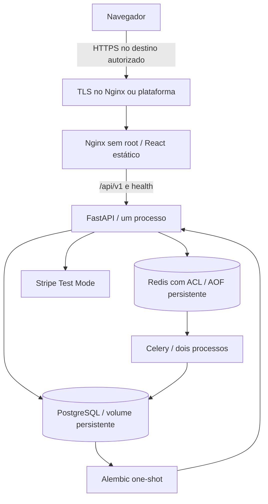

# OrderFlow — produção local e preparação de deploy

Não há servidor, domínio ou plataforma remota escolhidos/autorizados. Este
runbook prepara o deploy e valida containers localmente. Não cria recursos pagos,
registry público ou CD automático. A release v1.1.0 continua sendo a última;
uma próxima release exige deploy remoto validado e Quality/Security verdes.

## Arquitetura



`compose.yaml`: desenvolvimento, rede padrão, PostgreSQL/Redis/API/frontend em
loopback; Vite no host opcional. `compose.production.yaml`: **independente**, sem
combinar com o arquivo de desenvolvimento. Rede `edge` para frontend/API;
`data` com `internal: true` para API, migration, worker, banco e Redis. Somente
frontend publica porta. API usa `edge` para saída Stripe; worker atual só usa
banco/Redis privados e não necessita saída externa. Não existe Celery Beat.

Volumes `postgres_data` e `redis_data` são separados por nome do projeto Compose.
Redis usa ACL com usuário `orderflow`, usuário default desativado e AOF; seu
papel continua sendo broker/result backend/cache, não banco de domínio.

API e worker preservam a imagem Python 3.12 existente e usuário `orderflow`.
Frontend roda com UID/GID 101; API, worker, migration e frontend têm rootfs
somente leitura, `/tmp` temporário, capabilities removidas e no-new-privileges.
A API usa um processo Uvicorn. Worker usa dois processos configuráveis por
`CELERY_CONCURRENCY`: tarefas atuais são curtas e os três processos de aplicação
somam no máximo 45 conexões (pool SQLAlchemy 5 + overflow 10 por processo), abaixo
do default PostgreSQL de 100. Avalie CPU, memória e limite de conexões antes de
aumentar concorrência ou réplicas. Migration acrescenta um pool só durante o job.

## Pré-requisitos e configuração pública

Docker com Compose >= 2.24.4 (overlay TLS usa `!override`), Git, espaço para volumes
e Node 24/Python >= 3.12 apenas para os checks no host. O runtime não usa Vite.

```powershell
Copy-Item .env.production.example .env.production
$env:IMAGE_TAG = git rev-parse HEAD
```

Edite `.env.production`: tag exata do commit, diretório de secrets, nome/user do
banco, bind/porta frontend, origem CORS exata, nível de log e concorrência.
Nunca use `latest` como única referência. Variáveis exportadas no terminal têm
precedência sobre `.env.production`; confira-as antes de operar outro ambiente.
Arquivos `.env.production`, `.secrets/`, `.certs/` e `.backups/` são ignorados no
Git e no build Docker. O exemplo versionado não contém credenciais.

## Secrets

Compose monta somente os secrets autorizados para cada serviço em `/run/secrets`.
Pydantic Settings lê esses arquivos; argumentos explícitos, ambiente e `.env`
têm precedência. **Não defina DSNs/secrets vazios em environment**, pois eles
substituiriam os arquivos. A imagem não contém `.env` e o Compose de produção
passa somente configuração pública via environment.

| Arquivo/variável | Classificação | Uso |
| --- | --- | --- |
| `DATABASE_URL` | Secret | DSN psycopg com credencial do PostgreSQL |
| `REDIS_URL` | Secret | Redis autenticado para readiness |
| `CELERY_BROKER_URL` | Secret | Redis autenticado, DB 0 |
| `CELERY_RESULT_BACKEND` | Secret | Redis autenticado, DB 1 |
| `JWT_SECRET_KEY` | Secret | Valor aleatório exclusivo, >= 32 caracteres |
| `STRIPE_SECRET_KEY` | Secret opcional | Test Mode; arquivo vazio desabilita integração |
| `STRIPE_WEBHOOK_SECRET` | Secret opcional | Signing secret do endpoint; vazio desabilita webhook |
| `postgres_password` | Secret de infraestrutura | `POSTGRES_PASSWORD_FILE` no PostgreSQL |
| `redis_password`, `redis_acl` | Secrets de infraestrutura | Credencial de health e ACL do Redis |
| `ORDERFLOW_ADMIN_PASSWORD` | Secret temporário opcional | Bootstrap; prefira prompt sem eco |
| Certificado TLS | Público | Cadeia PEM do domínio autorizado |
| Chave privada TLS | Secret | Montada apenas no frontend com overlay TLS |
| `IMAGE_TAG`, `SECRETS_DIR`, `POSTGRES_DB`, `POSTGRES_USER`, portas/binds | Configuração pública | Compose |
| `CORS_ORIGINS`, `LOG_LEVEL`, concorrência, TTL JWT | Configuração pública | Aplicação/processos |
| `VITE_API_BASE_URL=/api/v1` | Configuração pública de build | Incorporada ao bundle |

Em deploy remoto, obtenha secrets pelo mecanismo seguro do operador/provedor,
nunca por commit, argumento de build ou logs. Monte arquivos legíveis pelo UID
do container e proteja o diretório no host contra outros usuários. Compose local
usa bind mounts: `uid/gid/mode` de secrets file não mudam permissões do arquivo
original. Defina ownership/permissões adequados no host; não dependa de `mode`
para corrigir arquivos ilegíveis. Secrets locais não são um cofre criptografado.

DSNs devem corresponder aos arquivos de senha/ACL: PostgreSQL usa hostname
`postgres:5432`; Redis usa `redis:6379`, usuário `orderflow` e senha URL-encoded.
Use DB 0 para Redis/broker e DB 1 para resultados. ACL deve desativar `default` e
habilitar o usuário autenticado com comandos/key/channel necessários ao Celery.
Os arquivos Stripe existem mesmo quando vazios, para permitir startup sem Stripe.
Trocar senha PostgreSQL exige rotação no banco existente: `POSTGRES_PASSWORD_FILE`
só inicializa um volume vazio. Rotacionar secrets requer recriar consumidores.

## Produção local isolada

O gerador abaixo é **somente para smoke local**, cria senhas aleatórias e recusa
sobrescrever arquivos existentes. Mantém diretório 0700 no Linux e arquivos
legíveis pelos bind mounts dos containers; não reutilize os secrets no remoto.
No Windows, mantenha os arquivos na conta local e revise ACLs antes de outro uso.

```powershell
python scripts/local_production_secrets.py
$env:IMAGE_TAG = git rev-parse HEAD
$env:SECRETS_DIR = './.secrets/local-smoke'
$env:CORS_ORIGINS = 'http://127.0.0.1:8080'
docker compose --env-file .env.production.example -f compose.production.yaml -p orderflow-local-smoke config --quiet
docker compose --env-file .env.production.example -f compose.production.yaml -p orderflow-local-smoke build
docker compose --env-file .env.production.example -f compose.production.yaml -p orderflow-local-smoke up -d --wait --wait-timeout 180
python scripts/smoke_containers.py
```

O script usa apenas loopback e um projeto terminado em `-smoke`; cria dados
sintéticos e uma conta local, sem imprimir senha/JWT e sem chamar Stripe. Valida
assets, headers/cache, refresh em `/orders`, `/orders/1`, `/admin/users`, health,
login/JWT, roles, dashboard e endpoints de clientes/produtos/pedidos/pagamentos,
refunds, usuários e execução real Celery. Reinicia banco/Redis e verifica dados;
para a API temporariamente e exige erro 502/504, preservando SPA e frontend health.
Ao terminar, a stack fica disponível em `http://127.0.0.1:8080`.

Confirme também no navegador, com conta de teste: PT-BR/en, datas/moedas/erros,
logout, `401` limpando sessão, refresh mantendo JWT e nova aba independente.
Uma nova aba sem opener inicia `sessionStorage` vazio; abas abertas com opener
podem receber uma cópia inicial segundo o comportamento padrão do navegador.
Verifique sidebar, tabelas, formulários, modais e detalhes em desktop/tablet/mobile.

## Build, migration e atualização de um destino autorizado

Antes: destino/custos aprovados, backup verificado, secrets corretos, imagens do
commit aprovado e CI verde. Se houver registry, use-o só quando autorizado pelo
destino; a CI atual não publica imagens. Guarde imagens/digests anteriores para
rollback. Não reutilize o volume local de smoke para dados reais.

```bash
docker compose --env-file .env.production -f compose.production.yaml config --quiet
docker compose --env-file .env.production -f compose.production.yaml build
docker compose --env-file .env.production -f compose.production.yaml up -d --wait postgres redis
# Para atualização, pare os consumidores e execute um único job de migration.
docker compose --env-file .env.production -f compose.production.yaml stop api worker
docker compose --env-file .env.production -f compose.production.yaml run --rm migrate
docker compose --env-file .env.production -f compose.production.yaml up -d --wait --wait-timeout 180
```

No primeiro startup, `depends_on` exige PostgreSQL saudável → Alembic concluído →
API ready → frontend/worker. Migration tem restart `no`; serviços contínuos têm
`unless-stopped`. Nunca execute migration em cada réplica. Há janela de manutenção
durante uma atualização Compose; não há garantia de deploy sem indisponibilidade.
Mantenha um nome de projeto fixo por ambiente para preservar os volumes.

## HTTPS, proxy e Stripe

O destino público deve usar HTTPS. Opções preparadas:

1. Plataforma/load balancer termina TLS e encaminha ao frontend privado. Preserve
   `/api/v1` na mesma origem, limite acesso à porta interna e mantenha firewall.
2. Nginx termina TLS com certificado e chave fornecidos pelo operador:

```bash
docker compose --env-file .env.production -f compose.production.yaml -f compose.https.yaml config --quiet
docker compose --env-file .env.production -f compose.production.yaml -f compose.https.yaml up -d --wait
```

O overlay substitui a publicação HTTP pela HTTPS (8443 interno; configure 443
no host autorizado). Default continua loopback. Configure `HTTPS_BIND` somente
após revisar firewall/exposição. Não há compra de domínio, emissão automática
ou renovação de certificados; o operador precisa fornecer cadeia válida para o
hostname, manter renovação e recriar frontend após rotação. HSTS é enviado só
no listener TLS; não há `includeSubDomains` nem preload. O listener HTTP interno
mantém `/healthz` para Docker e redireciona outras rotas, sem publicar essa porta.

Nginx sobrescreve `Host`, `X-Real-IP`, `X-Forwarded-For` e `X-Forwarded-Proto` com
dados da conexão; não encadeia headers fornecidos pelo cliente. Uvicorn usa
`proxy_headers=False`, portanto não confia em IP/esquema encaminhado. Hoje a API
não precisa gerar URLs públicas nem cookies; o navegador usa caminhos relativos.
Se uma futura integração exigir IP/esquema original atrás de outro proxy, configure
explicitamente a allowlist desse proxy em uma mudança auditada. Não use trust `*`.
Redirects de path canônico da API são reescritos como caminhos relativos pelo
Nginx, preservando HTTPS inclusive quando TLS termina na plataforma externa.
CORS continua configurável com origens exatas e sem cookies (`allow_credentials=False`).

Timeouts: Axios 15s; conexão proxy 5s, leitura/envio 15s, resolução Docker DNS 2s;
readiness 2s e health HTTP 3s. Read/send são tempos entre operações, não deadline
global. Não foram aumentados timeouts/retries Stripe nem política de retry Celery.
Celery preserva retries limitados para falhas transitórias de banco; shutdown do
worker tem graça de 30s. Verifique tasks/logs após encerrar e reiniciar o worker.

Stripe permanece Test Mode, sem cartão real. O webhook real é
`https://<hostname-autorizado>/api/v1/webhooks/stripe`; exige assinatura
`Stripe-Signature` e signing secret **desse endpoint**. Não reutilize signing secret
da Stripe CLI local. Teste PaymentIntent/refund/webhook somente com autorização
e credenciais de teste do ambiente. A API não expõe `client_secret`: não há
Stripe Elements/confirmação de cartão no navegador. Não há refresh token/signup.

## Health, logs e smoke remoto

`/healthz` mede Nginx; `/health/live` mede processo API; `/health/ready` testa
PostgreSQL e Redis e retorna 503 quando indisponíveis. Readiness deve passar antes
de receber tráfego; não substitua por teste de porta. Worker tem ping Celery.
API pode responder 404/401/403/503; o proxy preserva esses códigos. API parada ou
sem DNS/conexão resulta em 502/504, nunca `200 + index.html`.

```bash
docker compose --env-file .env.production -f compose.production.yaml ps -a
docker compose --env-file .env.production -f compose.production.yaml logs --tail 100 frontend api worker migrate
docker compose --env-file .env.production -f compose.production.yaml exec api alembic current
docker compose --env-file .env.production -f compose.production.yaml exec worker celery -A app.celery_app:celery_app inspect ping
```

API/worker continuam enviando JSON com correlation ID para stdout/stderr. Nginx
registra método/path/status e correlation ID devolvido pela API, sem query string,
Authorization ou corpo. Não copie credenciais para relatórios. Error log Nginx
pode conter a URI de uma requisição com erro; nunca coloque secrets em URLs.

Após deploy autorizado, confira certificado válido/HTTPS, frontend/assets, três
health endpoints, login, domínio completo do painel, roles, idiomas, logout,
refresh, responsividade e ausência de mixed content. Use dados sintéticos e conta
de teste. O script local não deve ser apontado para remoto/dados reais.

## Backup e restore

PostgreSQL contém os dados de domínio: backup ao menos diário e antes de cada
migration, em armazenamento separado, criptografado, com acesso restrito e retenção
definida pelo operador (base inicial: 7 diários + 4 semanais). Teste restore
regularmente em projeto/banco isolado. Em banco gerenciado, habilite backup/PITR
do provedor e teste recuperação antes de considerar o deploy pronto.

Use `pg_dump` dentro do container e `compose cp`, evitando redirecionar bytes
binários pelo Windows PowerShell 5.1:

```bash
docker compose --env-file .env.production -f compose.production.yaml exec -T postgres pg_dump -U orderflow -d orderflow -Fc -f /tmp/orderflow.dump
docker compose --env-file .env.production -f compose.production.yaml cp postgres:/tmp/orderflow.dump .backups/orderflow-<timestamp>.dump
```

Crie `.backups/` antes e ajuste usuário/banco conforme a configuração. Em uma
**instância isolada de recuperação**, copie o dump e restaure em banco novo:

```bash
docker compose --env-file .env.production -f compose.production.yaml cp .backups/orderflow-<timestamp>.dump postgres:/tmp/restore.dump
docker compose --env-file .env.production -f compose.production.yaml exec -T postgres createdb -U orderflow orderflow_restore
docker compose --env-file .env.production -f compose.production.yaml exec -T postgres pg_restore -U orderflow -d orderflow_restore --no-owner --single-transaction --exit-on-error /tmp/restore.dump
```

Confirme schema, contagens e fluxos antes de direcionar aplicação para o banco
restaurado. Proteja também secrets/configuração/certificados com backup seguro
separado. Para Redis AOF, faça snapshot consistente do volume com worker/API
parados se a recuperação de mensagens for necessária. AOF não é backup nem
garante exactly-once; pode haver entrega duplicada ou perda na janela entre
commit PostgreSQL e publicação (não há outbox).

## Rollback

Pare API/worker, escolha a tag/digest anterior preservado, confira compatibilidade
do schema e recrie **apenas consumidores** com `up -d --no-deps api worker frontend`.
Valide readiness e smoke. Não rode migrations antigas automaticamente; não faça
`alembic downgrade` em dados reais. Se o schema novo não for compatível, mantenha
manutenção e use correção progressiva ou restore de backup para banco isolado,
com decisão explícita sobre perda de dados. Nunca use `down -v` em produção.
`down` sem volumes preserva PostgreSQL/Redis; use projeto fixo ao reiniciar.

## Segurança e opções de destino

Quality testa ambos os projetos e a stack. Security faz Gitleaks, npm audit,
pip-audit, Trivy HIGH/CRITICAL e SBOM CycloneDX para ambas as imagens. Existem
oito exceções Debian preexistentes, restritas por pacote e com expiração em
**22/10/2026**, descritas na [revisão](SECURITY_REVIEW_PHASE_19.md). Não foram
ampliadas/renovadas. Reavalie antes de qualquer deploy após essa data.

| Opção | Preparação necessária | Custo e operação |
| --- | --- | --- |
| VM/servidor já existente | Docker, firewall, certificado, disco e backup | Sem nova contratação; usa capacidade existente. Operador mantém OS/TLS/backups. |
| VPS/VM nova | Aprovação do provedor/plano/região, SSH, TLS, backup | Mensalidade, disco, tráfego e backup dependem do plano; cotação antes de provisionar. |
| Plataforma de containers + PG/Redis privados | Adequar serviços/jobs/volumes/secrets ao provedor e registry | Compute, banco, Redis, storage e saída podem ser cobrados separadamente; verificar proposta completa. |

Nenhuma opção foi contratada. Não há custo cloud novo, URL pública, domínio,
certificado remoto ou região a reportar. Um provedor será escolhido somente com
destino e orçamento autorizados; não há promessa de free tier ou preço fixo.

Referências: [produção com Compose](https://docs.docker.com/compose/how-tos/production/),
[secrets Compose](https://docs.docker.com/compose/how-tos/use-secrets/),
[Nginx sem privilégios](https://github.com/nginx/docker-nginx-unprivileged),
[variáveis Vite públicas de build](https://vite.dev/guide/env-and-mode).
